# Gamma during natural viewing: establishing the neural signals

**Part 1 · Working report for discussion · 28 September 2026**

This report starts with the biological motivation, then asks whether our simultaneous eye, spike, and field recordings contain the neural signatures reported in the literature. It presents the completed 30-session comparisons and follows one recording from each animal through the same analyses. Later installments can address individual oscillatory bouts, eye–neural coupling, and stimulus information.

## 1. Why this question is interesting

The starting observation is Figure 5 of Ahissar and Arieli’s *Figuring Space by Time* (2001): the frequency ranges of small fixational eye movements and visually driven cortical oscillations overlap.

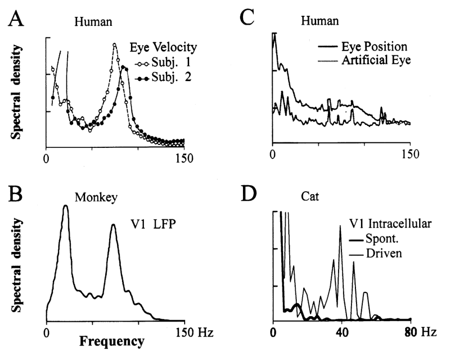

**Figure 1. The observation that motivates the project.** Panels from Ahissar and Arieli (2001), Figure 5, extracted from the supplied paper. A: horizontal eye-velocity spectra from two humans. B: visually driven monkey V1 LFP spectra. C: human eye-position and artificial-eye spectra. D: spontaneous and driven membrane-potential spectra from a cat V1 cell. These are different experiments, species, and recording conditions—not simultaneous measurements demonstrating coupling. Their resemblance motivates a test. [Source](https://doi.org/10.1016/S0896-6273(01)00466-4).

A stationary photograph does not produce stationary input to the retina. During fixation, drift and tremor move the image across photoreceptors. An image edge or fine texture therefore becomes a time-varying input. The hypothesis is that the nervous system could use some of this timing to represent spatial detail. Similar eye and cortical frequencies are suggestive, but they do not establish that the two signals interact or that their interaction carries useful visual information.

The relationship between image structure and cortical gamma makes this question more concrete. Uran, Peter and colleagues, including Pascal Fries, found that natural images with more predictable local structure produced stronger V1 gamma synchronization. The distinction is important: gamma was especially associated with the contextual predictability of **low-level image structure**, while firing rates were more closely related to predictability of **higher-level features**. Predictability is an appealing organizing idea, but it should not be paraphrased as gamma encoding semantic content. [Uran et al., 2022](https://doi.org/10.1016/j.neuron.2022.01.002).

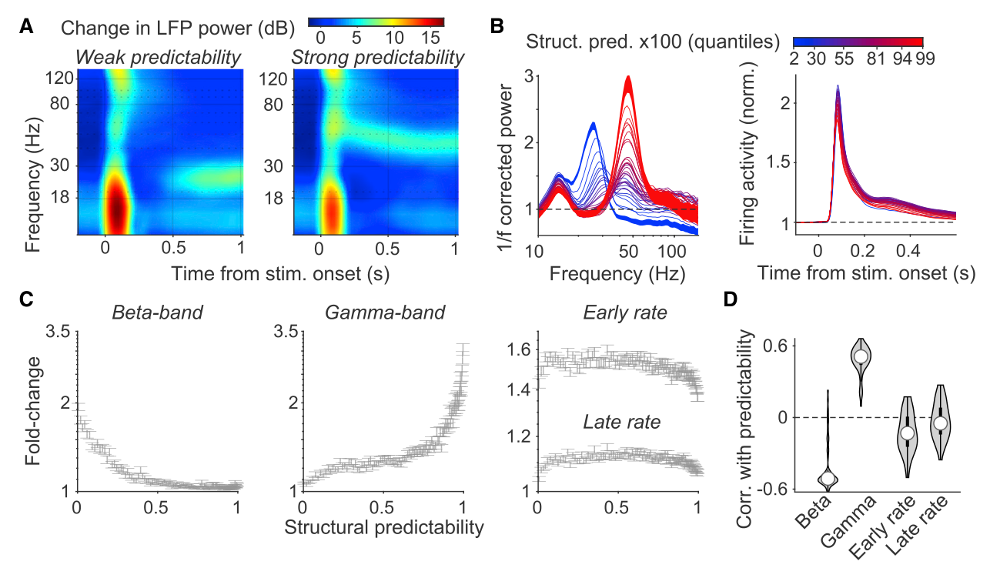

**Figure 2. Gamma depends on what the animal sees.** Uran et al. (2022), Figure 2, panels extracted from the supplied paper. The upper-left comparison shows different time–frequency patterns for weakly and strongly predictable image structure. The spectral curves and lower panels associate stronger structural predictability with stronger gamma, with a different relationship for firing rates. The paper’s 1/f-corrected spectra are different from the percentage-change spectra used below. We have not yet repeated its image-inpainting/predictability analysis in our animals. [Source](https://doi.org/10.1016/j.neuron.2022.01.002).

Together, these papers motivate three successive questions. First, what recurring neural signals are actually present in our V1 recordings? Second, do those signals relate to the retinal changes produced by gaze? Third, does their relationship reveal image information beyond what we can read from spike counts alone? This installment establishes the first comparison. Gamma, firing rates, and temporal codes need not be mutually exclusive explanations.

## 2. What our recordings look like

We have simultaneous high-resolution eye tracking, sorted spikes, and laminar field recordings during natural-image viewing in two marmosets, Allen and Logan. The analyses below use the **30 sessions already designated as good**: 14 from Allen and 16 from Logan. The probe has two shanks, each with 32 contacts at 35 µm depth spacing; the shanks are separated laterally by 200 µm. Receptive fields remain on the displayed image, as confirmed by the experimenter.

The eye tracker is sampled at its native rate, typically about 540 Hz, with session-specific differences. LFP is reconstructed at 1 kHz from raw recordings. Spikes retain their acquisition timestamps. A common clock lets us inspect all three without shifting one signal until it visually matches another. This chapter applies **no eye-to-neural response-delay shift**.

The two running examples are **Allen_2022-04-13** and **Logan_2019-12-20**. These are familiar sessions chosen for exposition, not statistically representative days. Within each, the single-trial example follows the previously fixed rule: the first quality-eligible trial at the median available contact of the superficial group on shank 1. No gamma threshold selected those trials. The later session-average panels use all eligible events in each example session.

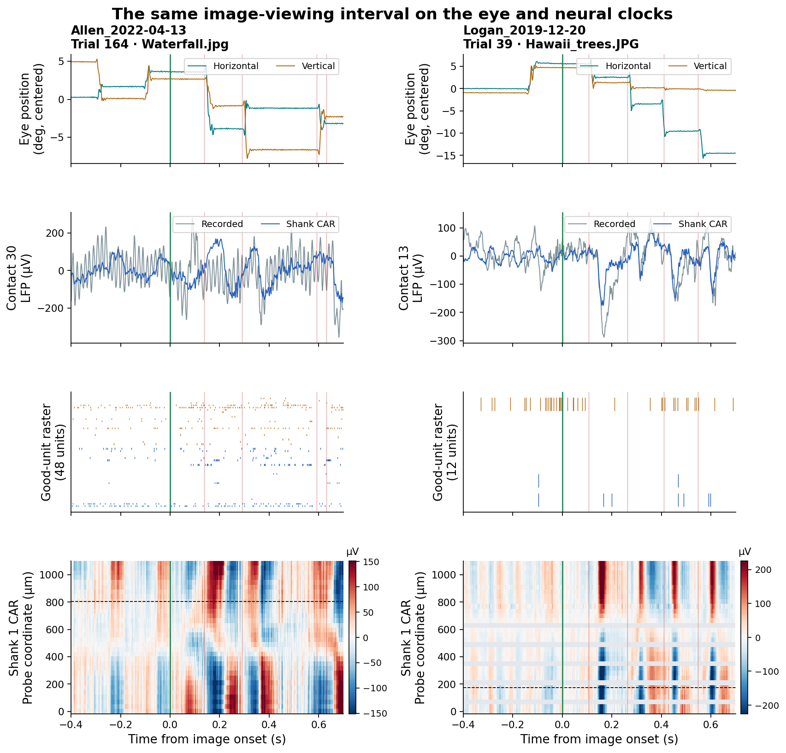

**Figure 3. The actual measurements, on one clock.** Columns show Allen April 13, trial 164, contact 30, and Logan December 20, trial 39, contact 13. Rows show centered horizontal/vertical eye position, full LFP with recorded and shank common-average references, good-unit spikes, and the shank-1 CAR depth map. Green is image onset; red marks detected peak saccade velocity. Raster units are ordered within shank; blue and orange ticks distinguish shanks 1 and 2. The depth-map dashed line marks the current input landmark. Gray gaps are missing/rejected samples or contacts. Depth-map color limits are fitted separately to each animal and printed in µV; equal colors therefore need not mean equal voltage across columns. No gamma bandpass or mains notch is used. Channel numbers follow the viewer’s zero-based identifiers.

Large slow voltage changes, rapid ripples, and brief deflections can coexist. The field is also shared to different degrees across contacts. Consequently, a visible ripple, a spike volley, and an increase in spectral power should not automatically receive the same interpretation. The examples make those distinctions inspectable before we average anything.

## 3. Preparing the field without defining gamma into it

The primary signal is calibrated broadband LFP derived from the original recording. We use a 250 Hz low-pass followed by anti-alias resampling to 1 kHz, with two seconds of context. Filtering does not cross acquisition gaps. We do not apply the fixation browser’s 30 Hz display high-pass to these analyses, and the primary figures are **unnotched**.

| Step | Purpose | Consequence for interpretation |
|---|---|---|
| Recorded voltage calibration and acquisition-clock conversion | Put contacts in µV and align them with behavior | Timing and amplitude remain physical measurements. |
| Context-aware filtering and anti-alias resampling | Retain the LFP range without chunk-edge artifacts | The earlier short-padding export had boundary errors; the present primary input is reconstructed from raw data. |
| Fixed contact-quality and local sample masks | Exclude dead, clipped, or invalid data | Rejected samples remain gaps, not zero voltage. A clip’s surroundings must not redefine its CAR contacts. |
| Separate shanks and depth groups | Preserve spatial differences | Calculate power or phase consistency at each contact before averaging; do not average signed voltages across layers. |
| Recorded, shank CAR, and lateral-difference comparisons | Examine the influence of shared voltage | Spatial subtraction can remove shared neural signal as well as interference. |
| Notch/line-projection sensitivity analyses | Check dependence on 60/120 Hz features | A line-like frequency is not identified as noise solely because subtraction removes it. |

Known-packet and transfer-function checks show that the software preprocessing retains about **98% of 80 Hz power**, about **95% at 100 Hz**, and about **62% at 180 Hz**. Thus, the software low-pass cannot by itself erase a large 80 Hz rhythm. Acquisition hardware has not been independently calibrated, and the upper part of the time–frequency maps needs more caution. In the saccade figures, the region above 180 Hz is shaded for that reason.

### What “superficial,” “input,” and “deep” mean here

These are **provisional functional depth groups**, not histological assignments. The existing landmark combines flash-CSD energy and flash high-frequency responses; Allen June 1 uses a manually specified interval midpoint. Contacts within ±140 µm of the center form the near-input group. Superficial/deep directions and anatomical exclusion bounds follow the stored probe map.

An independent check identifies a negative flash-CSD sink at 30–60 ms and requires it to be away from the CSD edge and reproducible within 70 µm across trial halves. **44 of 60 shanks qualify; eight of those differ from the existing landmark by more than 140 µm.** Sensitivity analyses compare the alternative landmarks on the same qualifying shanks. The main figures below retain the existing grouping, so their coverage remains the full cohort.

| Example session | Shank | Current landmark | Independent early sink | How much confidence to place in the grouping |
|---|---:|---:|---:|---|
| Allen April 13 | 1 | 805 µm | 805 µm | Agreement between the two definitions. |
| Allen April 13 | 2 | 420 µm | 665 µm | Reproducible alternative, but a substantial 245 µm discrepancy. |
| Logan December 20 | 1 | 175 µm | Not qualified | Existing grouping remains uncertain; the nominal sink does not pass the independent criterion. |
| Logan December 20 | 2 | 210 µm | 175 µm | Qualified alternative within one 35 µm contact step. |

Probe coordinates increase according to the acquisition geometry; they are not distances measured from a histologically identified cortical surface. The Logan example also has few retained deep contacts on one shank. Apparent layer differences should therefore be interpreted more cautiously than the presence of an event-related response itself.

## 4. Image onset: a direct comparison with Brunet and colleagues

Brunet et al. (2015), also with Fries, provide the natural-viewing benchmark. They recorded surface ECoG in macaques and reported pronounced 50–80 Hz activity during image viewing, with a lower-frequency excursion after saccades. Their Figure 2 connects the actual voltage to its spectrogram and spectral change. That is the comparison we want, rather than a spectrum detached from the waveform that generated it. [Brunet et al., 2015](https://doi.org/10.1093/cercor/bht280).

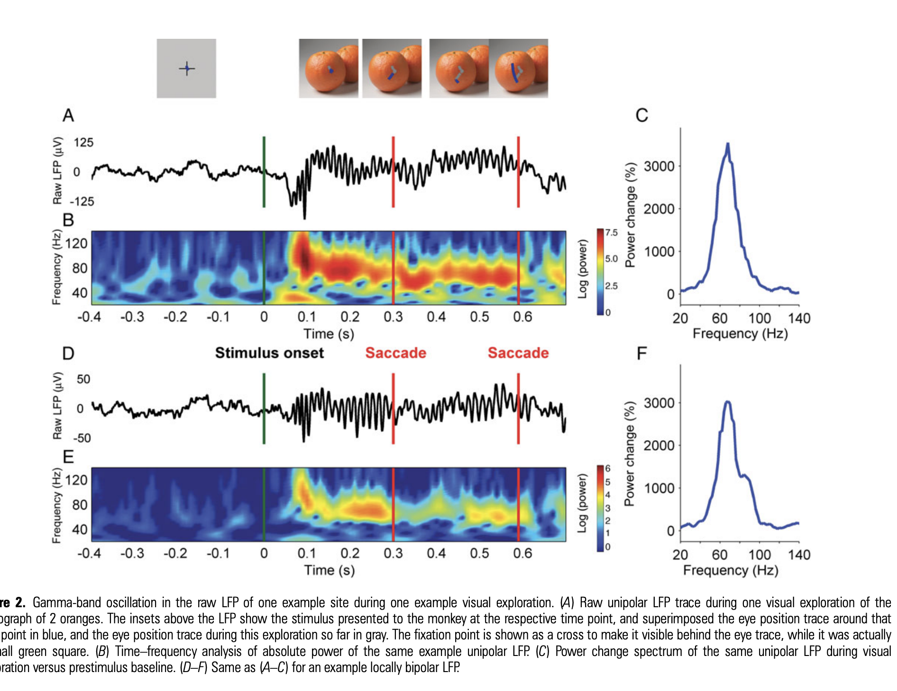

**Figure 4. The published benchmark.** Supplied Brunet et al. Figure 2. The green marker is image onset; red markers denote saccades. The figure shows a selected example with conspicuous repeated gamma cycles and a large spectral peak. Its effect size is not the expected value of an average over all contacts, depths, and sessions. [Source](https://doi.org/10.1093/cercor/bht280).

### The same three measurements in our two example sessions

For each example below, the left panels show voltage and a **four-cycle Hann time–frequency estimate** from the same contact and trial. The right panel compares image and pre-image spectra. It uses eight DPSS tapers, 500 ms windows, and ±8 Hz smoothing. Three overlapping image windows start at 0, 100, and 200 ms; the baseline is the 500 ms before image onset. These starts are explicit implementation choices because the paper does not specify their exact placement.

Power change is `100 × (image power / pre-image power − 1)`: +100% means twice the baseline power; zero means no change. A weak baseline can yield a large ratio. The spectrogram shows absolute power in dB, so its colors do not have that same interpretation. All three reference rows share one spectral color scale within an example, while voltage axes retain their own printed ranges.

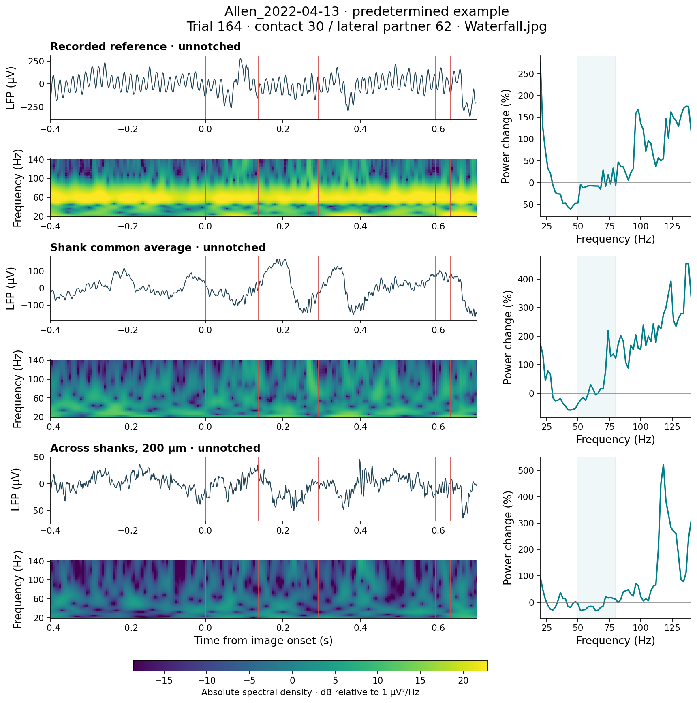

**Figure 5. Allen April 13, trial 164.** The same contact and time interval are shown with recorded reference, shank CAR, and contact 30 minus lateral partner 62. Time zero is image onset. The persistent band near 60 Hz in the recorded-reference example is present before the image and is strongly altered by spatial subtraction. This observation establishes a shared component, not its electrical or biological origin. The predetermined trial does not resemble the paper’s clean, large, sustained 50–80 Hz example.

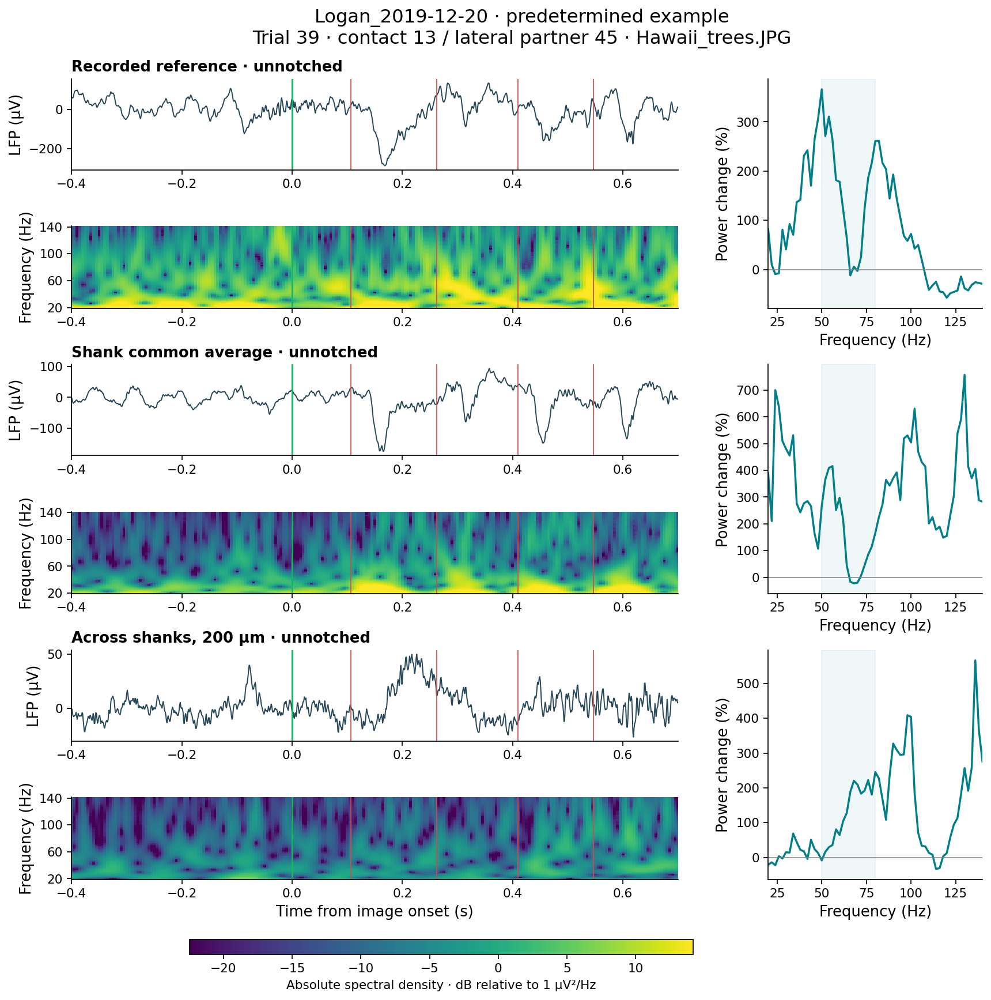

**Figure 6. Logan December 20, trial 39.** Contact 13 and lateral partner 45, selected by the same rule. Prominent deflections and changing frequency content accompany the viewing period. Spatial subtraction changes the waveform and spectral response substantially. This example contains faster fluctuations, but the figure alone does not distinguish a sustained narrow rhythm from transient contributions. The displayed trial is an illustration, not a prevalence estimate.

### Across sessions

The population comparison uses the paper’s **nonoverlapping 500 ms Hann windows after the first 300 ms of image viewing**, with paired pre-image measurements. Image and baseline powers are averaged across paired trials before division at each contact; contact ratios are then averaged within depth group, followed by equal weighting of sessions within each animal. This uses 4,262 paired trials. Its denominator differs from the saccade analysis because eligibility requires different temporal support.

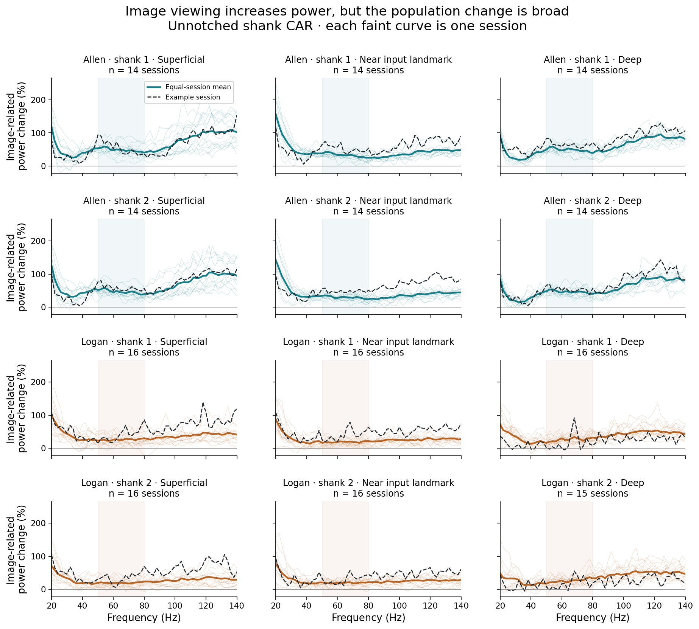

**Figure 7. A population response, with the variation between sessions visible.** Unnotched shank CAR. Each faint curve is one session; the thick colored curve is the equal-session mean. The black dashed curve is the running example session for that animal. The pale vertical region marks 50–80 Hz. Shanks and depth groups remain separate; the plots do not average voltages across the probe. The session spectra include ongoing saccades and short fixations and do not select the most gamma-responsive third of sites. They reuse the earlier completed paired-baseline quality mask; the separate fixed-mask audit found little change to the broad population conclusion.

Across the six shank/depth group means, 50–80 Hz power is **30–49% above pre-image in Allen** and **19–26% above pre-image in Logan**. Much of the increase spans a wider frequency range. This supports an image-related increase in field activity, including gamma-range frequencies. It does not yet reproduce the paper’s strong, sustained, narrow-band phenotype as a general feature of our recordings. Separately selected trials can show clearer recurring cycles; they must not replace the all-session summary or be used to estimate prevalence.

## 5. The saccade cycle: power and phase are different measurements

Ito et al. (2013) provide a second benchmark during natural viewing. Their Figures 3 and 4 ask two complementary questions: does activity at a frequency become stronger after a saccade, and does the field return to a similar phase at that time on successive saccades? A strong oscillation can start at a different phase each time. High power therefore does not require high phase alignment. [Ito et al., 2013](https://www.frontiersin.org/journals/systems-neuroscience/articles/10.3389/fnsys.2013.00001/full).

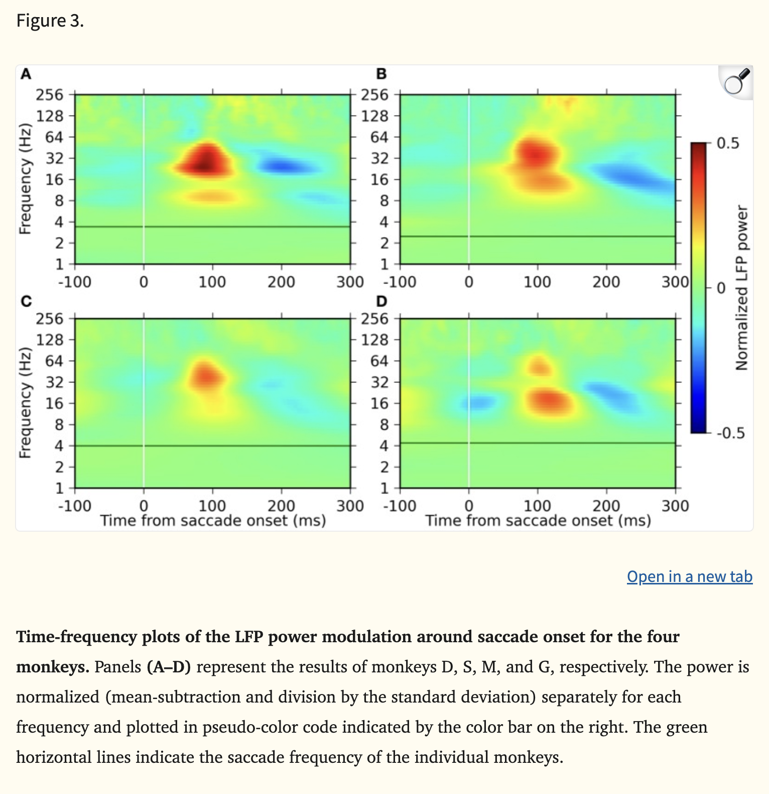
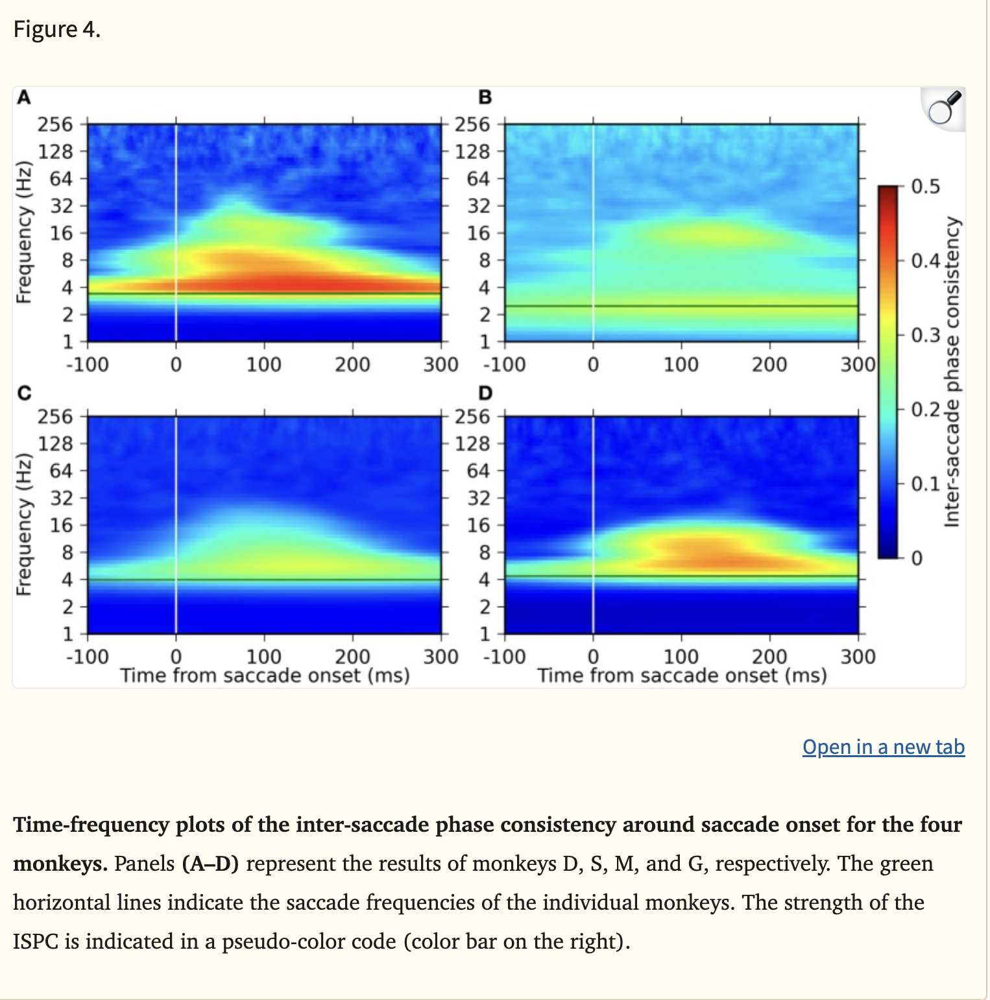

**Figure 8. The supplied Ito benchmarks.** Left: normalized power. Right: inter-saccade phase consistency. Both use saccade onset as time zero and show −100 to +300 ms. These measurements describe the repeated saccade cycle; they are not measurements of locking to individual tremor cycles. [Source](https://www.frontiersin.org/journals/systems-neuroscience/articles/10.3389/fnsys.2013.00001/full).

### How to read our counterparts

We use the paper’s approximately five-cycle Morlet construction and logarithmic frequency grid, retaining slow activity. For **power**, each contact/frequency is standardized using the mean and standard deviation over valid image-viewing time across trials, then averaged over saccades. Red means above that frequency’s usual power; blue means below it. This is a z-score, not a pre-image percentage change. A persistent 60 Hz component can consequently be inconspicuous in this display.

For **phase consistency**, we measure how concentrated the phases are across saccades at each contact and frequency. Zero indicates little repeatable phase and one indicates perfect agreement. We then average contact-level measurements within depth groups and give sessions equal weight. We never average signed voltage or phase angles across layers. Sample-size bias remains relevant; an unbiased squared phase-consistency measure was retained as a sensitivity check.

The main maps retain short fixations and surrounding saccades. Saccades follow the specified velocity/acceleration criteria; a separate sensitivity analysis requires ≥100 ms of stable fixation. Our eye positions are explicitly smoothed at 50 Hz for this event detector, unlike the paper’s search-coil acquisition. Continuous recording supplies wavelet context without crossing gaps. At 1 Hz, a five-cycle wavelet spans approximately five seconds: the slow-frequency rows cannot resolve a precise change confined to tens of milliseconds.

| Animal | Sessions | Usable image trials | Saccades in the main maps | Saccades passing the additional stable-fixation rule |
|---|---:|---:|---:|---:|
| Allen | 14 | 2,385 | 73,756 | 49,370 |
| Logan | 16 | 1,925 | 62,041 | 35,779 |
| Total | 30 | 4,310 | 135,797 | 85,149 |

These are event counts, not independent animal replicates. Overlapping windows and repeated image presentations are not independent observations. The cohort contains two animals.

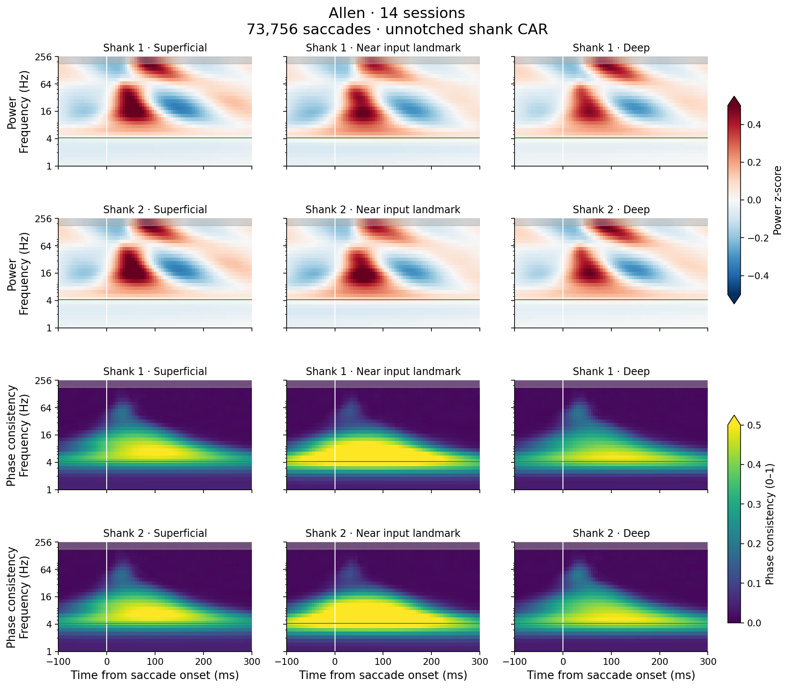

**Figure 9. Allen: 14 sessions.** Top two rows show power; bottom two show phase consistency. Each pair of rows separates the two shanks, with superficial, near-input, and deep groups across columns. The vertical white line is saccade onset. Green horizontal lines mark the inverse median inter-saccade interval. Gray shading above 180 Hz marks bandwidth caution, not a rejected-data region. Fixed scales allow comparison with Logan and the individual sessions: power −0.5 to +0.5 SD; phase consistency 0 to 0.5, with stronger values saturated. These colors do not represent significance tests.

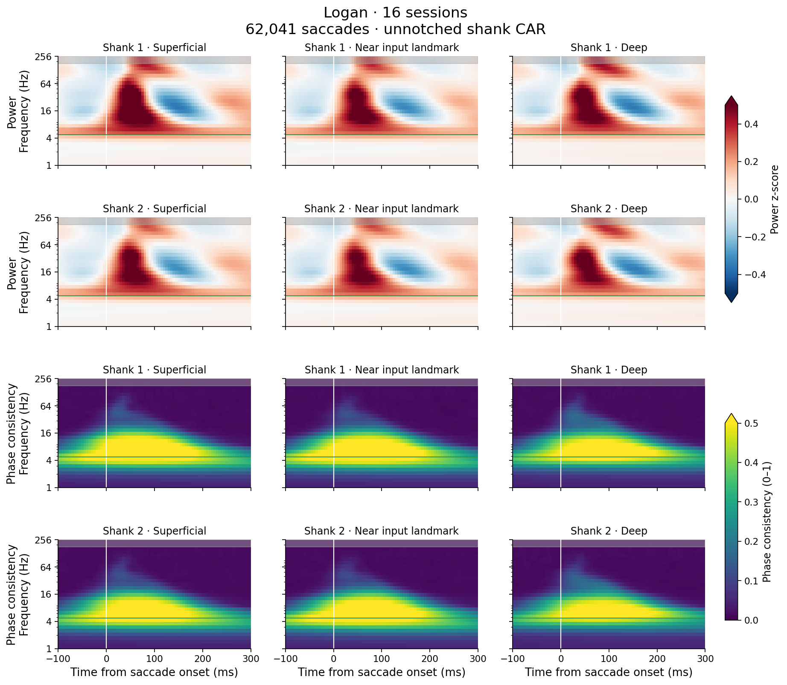

**Figure 10. Logan: 16 sessions.** The same estimator, normalization, arrangement, and color limits as Figure 9. Similar normalized power across depths need not mean identical voltage amplitudes. The phase panels establish repeatability relative to saccades; they do not establish that eye tremor sets cortical phase.

Both animals show a brief **20–40 Hz power increase after saccade onset**, followed by a decrease. The group mean time courses peak around **45–55 ms**, earlier than the approximately 100 ms peak visible in the supplied Ito figure. Event detection, species, and recording geometry differ; their contributions to the timing difference have not been isolated.

Slow phase is much more repeatable than gamma phase: over 50–150 ms, CAR group means have **2–8 Hz phase consistency of 0.32–0.49**, compared with **0.016–0.021 at 50–90 Hz**. These are ranges across group means, not confidence intervals. The slow-phase/fast-power distinction qualitatively matches the published pattern. The higher-frequency power near the post-saccadic response could include oscillations, spike-related activity, or sharp transients; the map alone does not separate them.

### The same analysis within the two example sessions

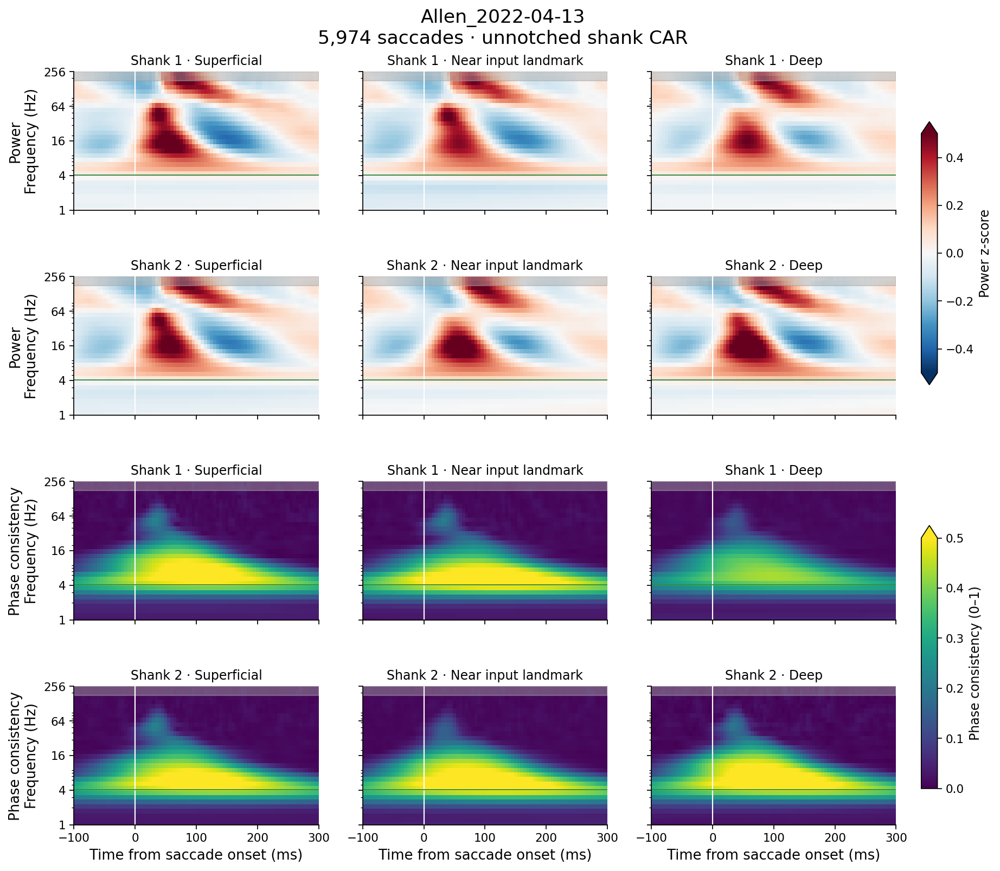

**Figure 11. Allen April 13: 192 image trials and 5,974 saccades.** Same axes, reference, groups, and color limits as the cohort maps. The image-onset trace in Figure 5 is one trial from this session; these maps average all eligible saccades. Shank 2’s current and independent depth landmarks disagree by 245 µm, so its nominal layer labels deserve particular caution.

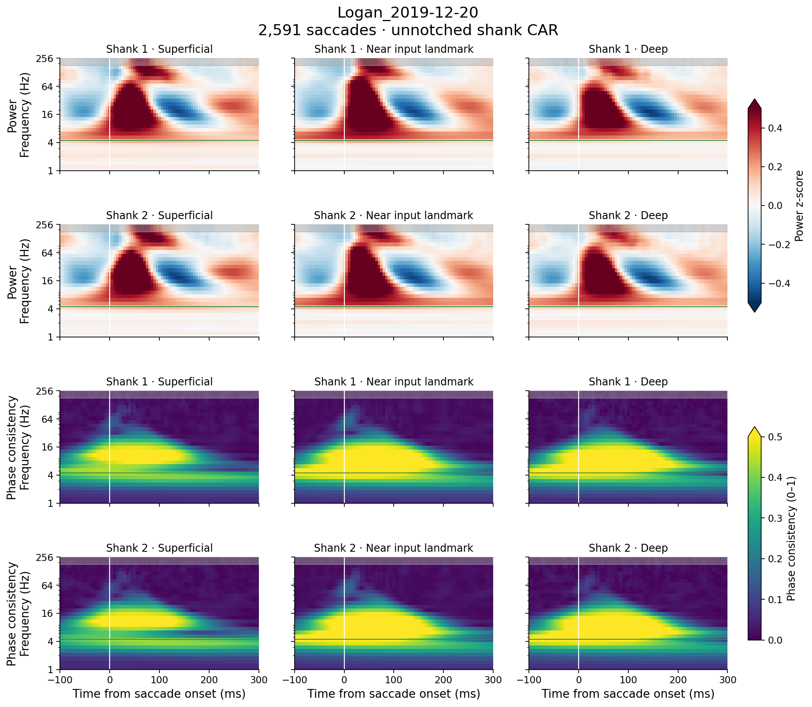

**Figure 12. Logan December 20: 86 image trials and 2,591 saccades.** Same measurement and scales. Individual-session structure is retained rather than replaced by the animal mean. The shank-1 input landmark lacks independent support, and some deep groups contain few contacts. These limitations affect anatomical interpretation, not the definition of time zero or normalization.

The main power and slow-phase patterns also remain in the completed checks using the stricter fixation rule, a 60 Hz notch, and independent flash-sink groupings on matched supported shanks. Cross-shank subtraction reduces slow phase consistency but preserves the main power response. These checks support the event-related signatures, while leaving their exact generators open.

## 6. What this first comparison establishes

| Published observation | What our data support so far | What remains open |
|---|---|---|
| Ahissar–Arieli: overlapping eye/cortical frequency ranges | A concrete motivation for simultaneous measurement | Frequency resemblance is not coupling or a demonstrated temporal code. |
| Uran and colleagues: gamma varies with predictable image structure | A literature-defined target for subsequent stimulus analysis | We have not reproduced its predictability manipulation or quantified the same image feature here. |
| Brunet and colleagues: image viewing produces gamma-range activity | Broad image-related power increases in both animals; inspectable fast waveform structure | A strong, sustained, isolated 50–80 Hz rhythm as the typical population phenotype is not established. |
| Ito and colleagues: saccade-related power modulation | A transient low-gamma/alpha–beta response in both animals | Its earlier peak in our data and the contribution of sharp transients need explanation. |
| Ito and colleagues: slow phase aligns across saccades | Stronger slow-frequency than gamma-frequency phase consistency | This is saccade alignment, not phase locking to high-frequency fixational eye motion. |

The practical result is a usable neural starting point: reproducible event-related field structure is present, and its relationship to the literature is now explicit. The next installment can ask which individual intervals contain genuine repeated cycles and what their spatial profiles look like. Only then should those intervals be used to evaluate a gaze-dependent timing code or additional image information.

### Differences that remain relevant

Our recordings use penetrating laminar probes in marmosets; Brunet used macaque surface electrodes, and Ito used capuchin tetrodes. Lateral subtraction between our shanks is closer to a surface-neighbor comparison than vertical bipolar subtraction, but it is not the same geometry. Our pre-image interval is not restricted to quiet fixation. Image timing uses the existing acquisition conversion and 8.3 ms display offset without a new photodiode calibration. These are explicit differences to investigate, not established explanations for the gamma discrepancy.

### References and provenance

1. Ahissar E, Arieli A. **Figuring Space by Time.** *Neuron* 32:185–201 (2001). [doi:10.1016/S0896-6273(01)00466-4](https://doi.org/10.1016/S0896-6273(01)00466-4). Figure 5 from the supplied PDF.
2. Uran C, Peter A, et al. **Predictive coding of natural images by V1 firing rates and rhythmic synchronization.** *Neuron* 110:1240–1257.e8 (2022). [doi:10.1016/j.neuron.2022.01.002](https://doi.org/10.1016/j.neuron.2022.01.002). Figure 2 from the supplied PDF. A published correction concerns Figure S5; the displayed figure is Figure 2.
3. Brunet N, Bosman CA, et al. **Visual Cortical Gamma-Band Activity During Free Viewing of Natural Images.** *Cerebral Cortex* 25:918–926 (2015). [doi:10.1093/cercor/bht280](https://doi.org/10.1093/cercor/bht280). Supplied Figure 2.
4. Ito J, Maldonado P, Grün S. **Cross-frequency interaction of the eye-movement related LFP signals in V1 of freely viewing monkeys.** *Frontiers in Systems Neuroscience* 7:1 (2013). [doi:10.3389/fnsys.2013.00001](https://doi.org/10.3389/fnsys.2013.00001). Supplied Figures 3 and 4.

This installment reuses completed, audited analyses; it does not refit models or change cohort inclusion. The figure manifest records exact sources, selections, and visual review. `session_coverage.csv` and `depth_landmarks.csv` accompany the editable report. The cohort spectra use the completed 4,262-trial benchmark; the image-onset examples use its fixed-quality follow-up; the Ito maps use the completed 4,310-trial analysis. Their different denominators are intentional and should not be combined as if they were the same sample. All displayed LFP analyses are unnotched, and all captions refer to that same treatment.
